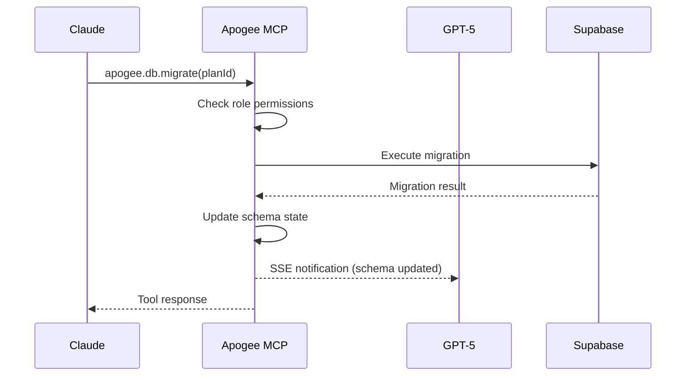
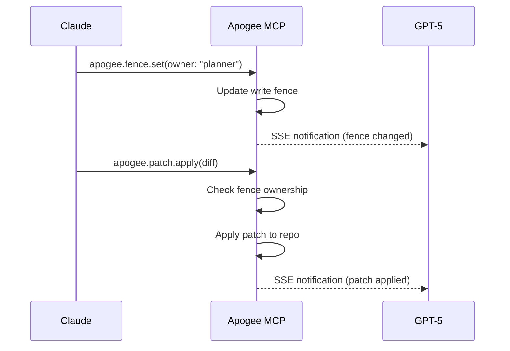

# Apogee AI Dev SDK Architecture

## Overview

Apogee implements the **Cooperation Model** for simultaneous AI development, enabling Claude Code (planner) and Cursor-agent/GPT-5 (implementer) to work together without conflicts through clear role separation and coordination protocols.

## Core Principles

### 1. Role-Based Ownership
- **Claude (Planner)**: Database schema, migrations, high-level architecture
- **GPT-5 (Implementer)**: Application code, tests, UI components

### 2. Write Fence Coordination  
- Only one agent can apply file patches at a time
- Prevents merge conflicts during simultaneous development
- Explicit handoff protocol with `HANDOFF::agent` signals

### 3. Real-Time Synchronization
- Live communication feed via MCP resources
- Shared todo board with assignments and status
- Event-driven state updates with SSE

## System Components

```
┌─────────────────┐    ┌─────────────────┐
│   Claude Code   │    │  Cursor Agent   │
│   (Planner)     │    │  (Implementer)  │
└─────────┬───────┘    └─────────┬───────┘
          │                      │
          │ MCP Protocol         │ MCP Protocol  
          │ (Remote HTTP)        │ (Stdio)
          │                      │
          └──────┬──────────────┬─┘
                 │              │
            ┌────▼──────────────▼────┐
            │                       │
            │   Apogee MCP Server   │
            │                       │
            ├─ Tools ───────────────┤
            │ • apogee.todo.*       │
            │ • apogee.fence.*      │
            │ • apogee.patch.*      │
            │ • apogee.db.migrate   │
            │                       │
            ├─ Resources ───────────┤  
            │ • log://comms         │
            │ • todos://board       │
            │ • schema://current    │
            │ • ci://latest         │
            │                       │
            ├─ State Management ────┤
            │ • Session State       │
            │ • Write Fence         │
            │ • Communication Log   │
            └─────────┬─────────────┘
                      │
              ┌───────▼───────┐
              │  Supabase     │
              │  MCP Server   │
              │ (DB Operations)│
              └───────────────┘
```

## Data Flow

### 1. Tool Execution


### 2. Write Fence Coordination


## Transport Protocols

### Stdio Transport (Local Development)
- Used by Cursor for direct subprocess communication
- Environment-based authentication (`APOGEE_ROLE`)
- Lightweight for single-user scenarios

### HTTP Transport (Production/Remote MCP)
- RESTful JSON-RPC over HTTPS
- JWT-based authentication with role scopes
- SSE for real-time event streaming
- CORS with origin validation

## Authentication & Authorization

### JWT Token Structure
```json
{
  "role": "planner|implementer",
  "sessionId": "unique-session-id",
  "clientId": "client-identifier", 
  "scopes": ["db:migrate", "db:exec"],
  "iat": 1640995200,
  "exp": 1640995200
}
```

### Permission Matrix
| Action | Planner | Implementer | Notes |
|--------|---------|-------------|-------|
| Read Resources | ✅ | ✅ | All resources accessible |
| Todo Management | ✅ | ✅ | Both can create/update todos |
| Write Fence | ✅ | ✅ | Both can change fence owner |
| Apply Patches | 🔒 | 🔒 | Only when fence owner |
| DB Migration | ✅ | ❌ | Planner exclusive |
| SQL Execution | ✅ | ❌ | Planner exclusive |

## State Management

### Session State Schema
```typescript
interface SessionState {
  id: string;
  todos: TodoItem[];
  writeFence: 'planner' | 'implementer'; 
  commsLog: CommMessage[];
  dbSchema?: DatabaseSchema;
  ciStatus?: string;
  lastUpdated: number;
}
```

### Event System
- **EventEmitter-based** internal coordination
- **Redis pub/sub** for scaling (optional)
- **SSE streams** for client notifications

## Database Integration

### Supabase MCP Connection
```typescript
// Conceptual - actual implementation uses MCP client
const supabaseMcp = new SupabaseMcpClient({
  projectUrl: process.env.SUPABASE_URL,
  apiKey: process.env.SUPABASE_ANON_KEY
});

await supabaseMcp.callTool('sql.exec', {
  sql: migrationSql,
  dryRun: false
});
```

### Schema Introspection
- Live schema updates after migrations
- Exposed via `schema://current` resource
- Cached with invalidation on changes

## Scaling Considerations

### Horizontal Scaling
- **Stateless server design** with external state store
- **Redis clustering** for session state
- **Load balancer** with session affinity

### Performance Optimizations
- **Resource caching** with TTL
- **Event debouncing** for high-frequency updates  
- **Pagination** for large communication logs

### Monitoring & Observability
- **OpenTelemetry** traces for tool execution
- **Structured logging** with correlation IDs
- **Metrics collection** for usage analytics

## Security Model

### Threat Mitigation
- **Origin validation** for CORS
- **JWT expiration** with refresh tokens
- **Rate limiting** per client/role
- **Audit logging** for all tool calls

### Network Security
- **TLS termination** at load balancer
- **VPC isolation** for internal services
- **Secret management** via Kubernetes secrets

---

This architecture ensures robust, scalable cooperation between AI agents while maintaining clear boundaries and preventing conflicts.